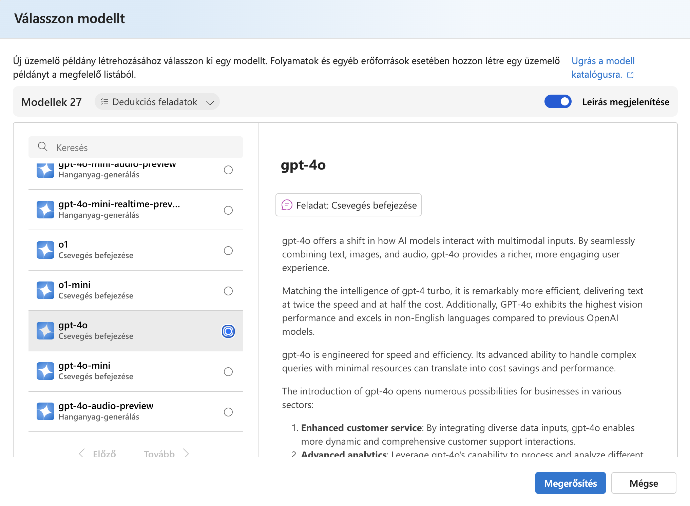
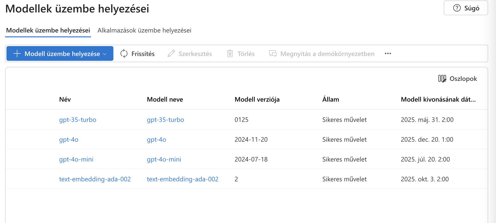
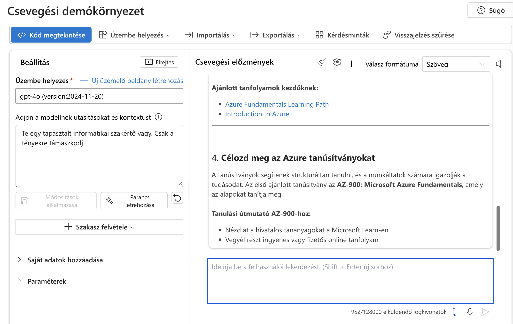

# Alap AI példa Azure-ban

Manapság a Mesterséges Intelligencia az egyik legfelkapottabb témakör. Emellett minden felhőszolgáltató igyekszik a saját AI szolgáltatásait minél jobban népszerűsíteni. Az Azure is ezen cégek közé tartozik, így én is úgy gondoltam, hogy érdemes lenne egy kis bevezetőt írni az Azure AI szolgáltatásairól.

## Azure AI

Az Azure AI egy olyan felhőalapú szolgáltatás, amely lehetővé teszi a fejlesztők számára, hogy könnyedén integrálják az AI-t a saját alkalmazásaikba. Az Azure AI szolgáltatások között megtalálhatóak a következők:

- Azure Cognitive Services
- Azure Machine Learning
- Azure Bot Service
- Azure Databricks
- Azure OpenAI
- Azure OpenAI Studio

Ezen szolgáltatások segítségével a fejlesztők képesek lehetnek például beszéd- és képfelismerésre, valamint gépi tanulásra alapozott alkalmazásokat készíteni.

Mi jelenleg az Azure OpenAI-t fogjuk megvizsgálni. Ez az amivel a leggyorsabban és legkönnyebben lehet elkezdeni.

## Azure Cognitive Services

Az Azure Cognitive Services egy olyan felhőalapú szolgáltatás, amely lehetővé teszi a fejlesztők számára, hogy könnyedén integrálják az AI-t a saját alkalmazásaikba. Az Azure Cognitive Services szolgáltatások között megtalálhatóak a következők:

- Vision
- Speech
- Language
- Decision
- Web Search

Ezen szolgáltatások segítségével a fejlesztők képesek lehetnek például beszéd- és képfelismerésre, valamint gépi tanulásra alapozott alkalmazásokat készíteni.

## Hogyan kezdjük el?

Azure-ban a legegyszerűbb eszközünk, ahol el tudjuk kezdeni, az [Azure OpenAI Studio](https://oai.azure.com/).

Itt egy egyszerű regisztrációt követően már el is kezdhetjük az AI modellek fejlesztését. Az Azure OpenAI Studio egy teljesen ingyenes eszköz, amely lehetővé teszi a fejlesztők számára, hogy könnyedén készítsenek és teszteljenek AI modelleket.

Itt találjuk a különböző modelleket, amelyeket az Azure Cognitive Services nyújt. Az egyes modellek használatához csak egy kattintásra van szükség, és már használhatjuk is azokat.

Ahhoz, hogy ezeket a modelleket használni tudjiuk, létre kell hoznunk egy Deployment-et. Ezt a Deployment-et aztán egy API-n keresztül tudjuk elérni, és használni a kiválasztott modelleket.

### Deployment létrehozása

1. Az Azure OpenAI Studio-ban kattintsunk a Deployment menüpontra.
2. Kattintsunk a **Create new deployment** gombra.
3. Válasszuk ki a kívánt modelt.
4. Adjunk neki egy nevet.
5. Állítsuk be az egyéb paramétereket.
6. Kattintsunk a **Create** gombra.

### Chat játszótér

Ha van egy Deploymentünk, akkor már használhatjuk is az adott modelt. Az Azure OpenAI Studio-ban található egy Chat játszótér, ahol kipróbálhatjuk az adott modelleket.

Ez így használhatjuk:

1. Az Azure OpenAI Studio-ban kattintsunk a Chat menüpontra.
2. Jobb oldalon, a **Configuration** részben válasszuk ki a Deploymentet.
3. A képernyő közepén lévő chat ablakban írjuk be a kérdéseinket.

## Saját adatforrás használata

Az Azure Cognitive Services lehetőséget ad arra, hogy saját adatforrásokat is használjunk. Ehhez az Azure OpenAI Studio-ban a **Data** menüpontra kell kattintanunk, és ott tudjuk hozzáadni a saját adatforrásainkat. Ez azért lehet nekünk hasznos, mivel ez esetben nem kell 100%-ban az AI által talált adatokra hagyatkoznunk, illetve egyéb előnyei is vannak:

- Az AI a mi adatainkon dolgozik, így nem kell aggódnunk a biztonság miatt.
- Az AI a mi adatainkon dolgozik. (Ez lehet a saját dokumentációnk, vagy akár a saját képeink.)
- Csökkenthetjük az AI-ra jellemző hallucinációt.
- Az AI válaszai a mi adatainkon alapulnak, így pontosabbak lehetnek.

Ez lehet akár md fájl is, ami a kódunk, alkalmazásunk dokumentációját tartalmazza. Az AI így könnyedén válaszolhat a felhasználó kérdéseire.

## Példa Azure OpenAI használatára

Az alábbi példában egy egyszerű chatbotot fogunk készíteni, amely képes válaszolni a felhasználó kérdéseire. 

Ehhez az alábbi erőforrások szükségesek:

- Azure OpenAI
- Azure tárfiók (Azure Storage account)
- Azure AI keresőszolgáltatás (Azure AI Search)

### 1. Azure OpenAI létrehozása

1. Lépjünk be az Azure Portalba.
2. Kattintsunk a **Erőforrás létrehozása** gombra.
3. Keressük ráa az **Azure OpenAI** lehetőségre.
4. Kattintsunk a **Létrehozás** gombra.
5. Töltsük ki a szükséges mezőket.
   - Tarifacsomag: Standard S0
6. A **Felülvizsgálat és létrehozás** oldalon kattintsunk a **Létrehozás** gombra kattintva hozzuk létre az erőforrást.

### 2. Azure tárfiók létrehozása

1. Lépjünk be az Azure Portalba.
2. Kattintsunk a **Erőforrás létrehozása** gombra.
3. Keressük meg az **Tárolás** kategóriát.
4. Válasszuk ki a **Tárfiók** lehetőséget.
5. Kattintsunk a **Létrehozás** gombra.
6. Töltsük ki a szükséges mezőket.
   - Redundancia: LRS
7. A **Felülvizsgálat és létrehozás** oldalon kattintsunk a **Létrehozás** gombra kattintva hozzuk létre az erőforrást.
8. Nyissuk meg a tárfiókunkat, és kattintsunk a **Tárolók** menüpontra.
9. Hozzunk létre egy új tárolót.
   - Név: ai-forras
   - Névtelen hozzáférés: Privát
10. Kattintsunk az `ai-forras` tárolóra, majd töltsük fel a jsonl fájlt, amelyet az AI szolgáltatásunknak szeretnénk használni, mint adatforrás.

### 3. Azure AI keresőszolgáltatás létrehozása

1. Lépjünk be az Azure Portalba.
2. Kattintsunk a **Erőforrás létrehozása** gombra.
3. Keressünk rá a **Azure AI Search** lehetőségre.
4. Kattints a **Létrehozás** gombra.
5. Töltsük ki a szükséges mezőket.
   - Név: mentor-ai-search
   - Hely legyen ugyanaz, mint a tárfiókunknak
   - Tarifacsomag: B (Alap)
6. Megjegyzés: Az AI Search ezen tarifa csomagja nagyjából **havi 27 000 Forint**ba kerül. (Ezért csak akkor érdemes használni, ha valóban szükségünk van rá.)
7. A **Felülvizsgálat és létrehozás** oldalon kattintsunk a **Létrehozás** gombra kattintva hozzuk létre az erőforrást.

### 4. Saját adatforrás használata Chatbothoz Azure OpenAI Studio-ban

1. Lépjünk be az Azure OpenAI Studio-ba.
2. Kattintsunk a **Chat** menüpontra.
3. A jobb oldalon, a **Configuration** részben válasszuk ki a Deploymentet.
4. A bal olalon, a **Setup** részben válasszuk ki a **Data** lehetőséget.
5. Töröljük ki a **Prompt** alatt lévő összes elemet.
6. Menjünk át az **Add your data** fülre.
7. Kattintsunk az **Add a data source** gombra.
8. Select a data source: **Azure Blob Storage**
9. Blob storage account: Válasszuk ki az előbb létrehozott tárfiókunkat.
10. Container: Válasszuk ki az `ai-forras` tárolót.
11. Azure AI Search-nél válasszuk ki a **mentor-ai-search**-t.
12. Enter the inxed name: dokumentum
13. Indexer schedule: hourly
14. Kattintsunk a **Next** gombra.
15. Kattintsunk a **Next** gombra.
16. Összegző képernyőn kattintsunk a **Save and close** gombra.
17. Pár perc múlva az adatforrásunk elérhető lesz a Chatben.

### 5. Webalkalmazás létrehozása Chatbothoz Azure-ban

1. Az előző pontban létrehozott Chat játszótérben kattintsunk a **Deploy to** gombra.
2. Válasszuk a **Create a new web app** lehetőséget.
3. Töltsük ki a szükséges mezőket.
   - Name: mentor-chatbot
   - Subscription: Válasszuk ki a megfelelő előfizetésünket.
   - Resource group: Válasszuk ki a megfelelő erőforrás csoportunkat.
   - Location: Válasszuk ki a megfelelő régiót.
   - Pricing plan: B1
   - Enable chat history in the web app: Igen
4. Kattintsunk a **deploy** gombra.
5. Ha elkészült, nyissuk meg.
6. Emngedélyezzük a hozzásférést a **Permissions requested** ablakban at **Accept** gombra kattintva,
7. Kezdjünk el beszélgetni az AI-val.

### 6. Példa kérdések 'prompt'

1. Ma már minden a mesterséges intelligenciáról (AI) szól: Mit jelent ez számunkra?
2. Hogyanm telepítek NodeJs 20-at Linuxra?
3. Hogyan telepítek Python3-at Windowsra?
4. Mi a Webhook alkalmazási területei?
5. Hogyan néz ki egy Cloud Administrator első napja?
6. Milyen segédanyagokat találok az Azure témájú képzésekhez?
7. Hogyan tudok kapcsolatot létesíteni az Azure Pipeline és a GitHub között?
